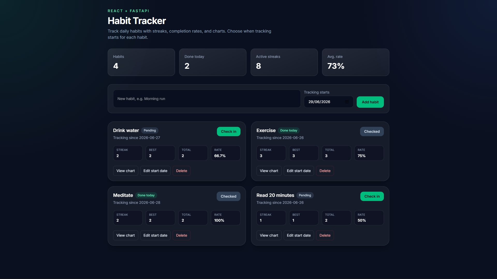
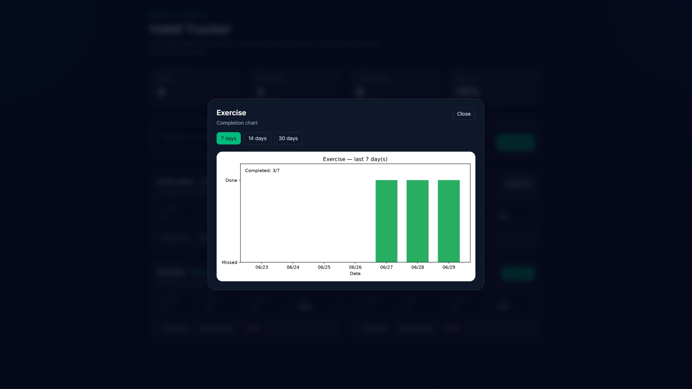
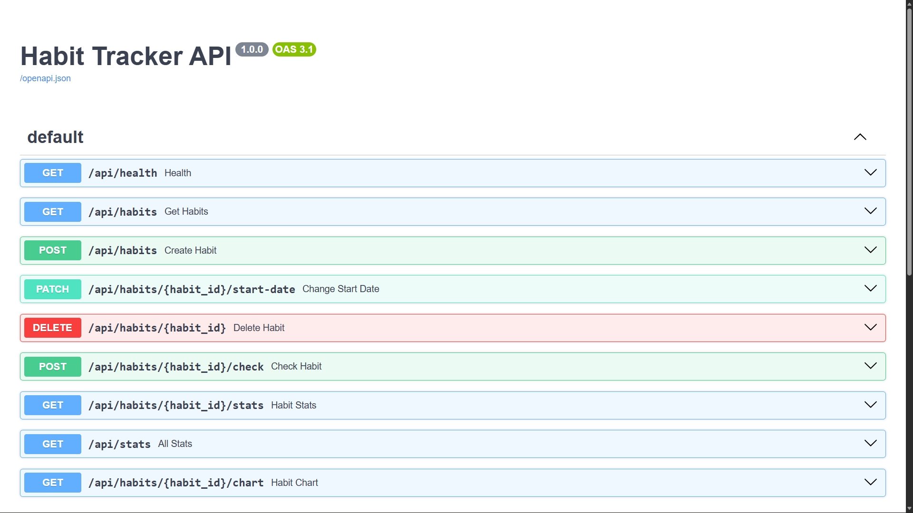
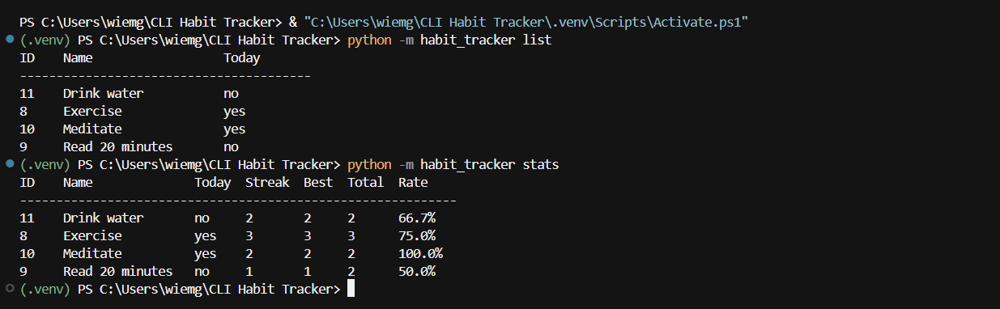

# Habit Tracker

A full-stack habit tracker built with **Python**, **SQLite**, **FastAPI**, **React**, and **matplotlib**.

Track daily habits from the CLI or a modern web dashboard — with streaks, stats, and charts.

## Screenshots

### Web dashboard



React dashboard with summary stats, daily check-ins, streaks, and completion rates.

### Completion chart



Matplotlib chart shown in the web UI — green bars for completed days, red for missed.

### REST API (FastAPI)



Auto-generated API docs at `/docs` — habits, check-ins, stats, charts, and start-date updates.

### CLI



Same SQLite data from the terminal — `list` and `stats` commands.

## Stack

| Layer | Tech |
|-------|------|
| Database | SQLite |
| Backend | FastAPI + Uvicorn |
| Frontend | React + Vite + TypeScript + Tailwind CSS |
| CLI | Python argparse |
| Charts | matplotlib |

## Features

- Add, list, and remove habits
- Log daily completions
- Streak and completion stats
- Matplotlib charts
- Modern web dashboard with live API

## Setup

### 1. Python backend

```bash
python -m venv .venv

# Windows
.venv\Scripts\activate

# macOS / Linux
source .venv/bin/activate

pip install -r requirements.txt
```

### 2. Frontend

```bash
cd frontend
npm install
```

## Run the web app

**Terminal 1 — API**

```bash
# from project root, with venv active
uvicorn backend.main:app --reload
```

API docs: http://127.0.0.1:8000/docs

**Terminal 2 — Frontend**

```bash
cd frontend
npm run dev
```

Open http://localhost:5173

## CLI usage

```bash
python -m habit_tracker add "Exercise"
python -m habit_tracker add "Exercise" --start-date 2026-06-01
python -m habit_tracker set-start "Exercise" --date 2026-06-01
python -m habit_tracker list
python -m habit_tracker check "Exercise"
python -m habit_tracker stats
python -m habit_tracker chart "Exercise"
python -m habit_tracker chart "Exercise" --days 30
```

The CLI and web app share the same SQLite database in `data/habits.db`.

## Project structure

```
CLI Habit Tracker/
├── backend/           # FastAPI REST API
├── frontend/          # React dashboard
├── habit_tracker/     # shared Python package (DB, stats, charts, CLI)
├── docs/Screenshots/  # README screenshots
├── data/              # SQLite database (gitignored)
├── charts/            # saved matplotlib figures (gitignored)
├── requirements.txt
└── README.md
```

## License

MIT
